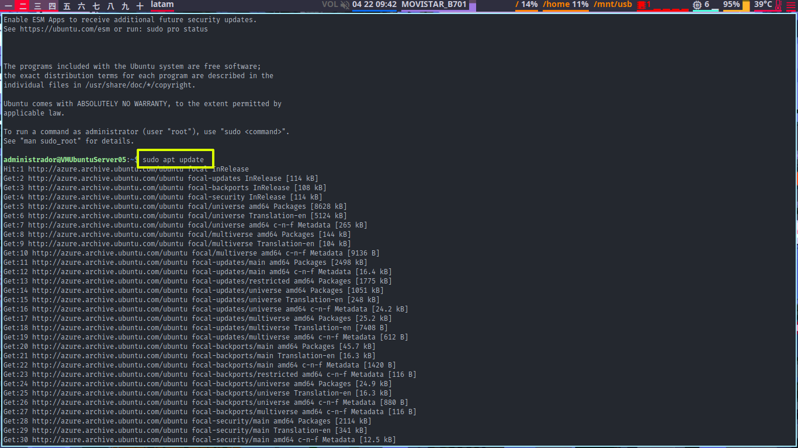
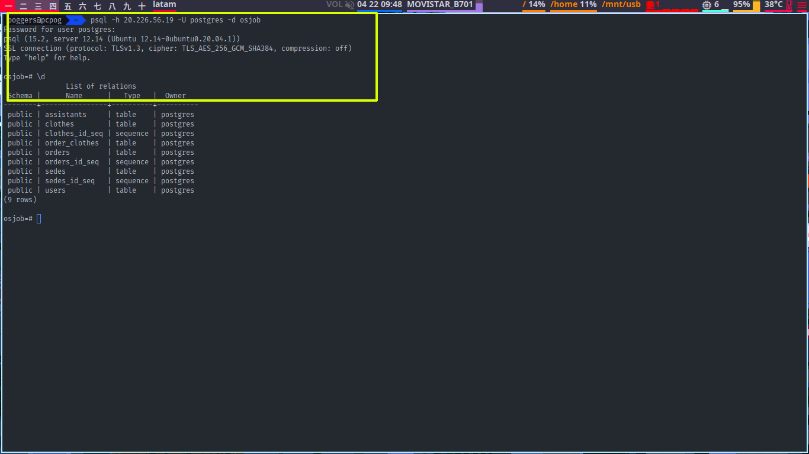
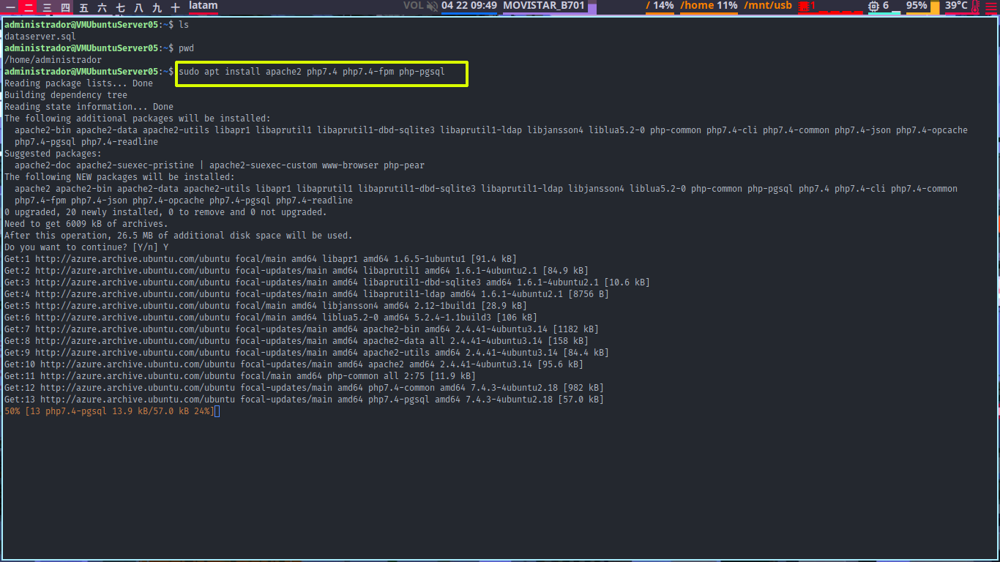
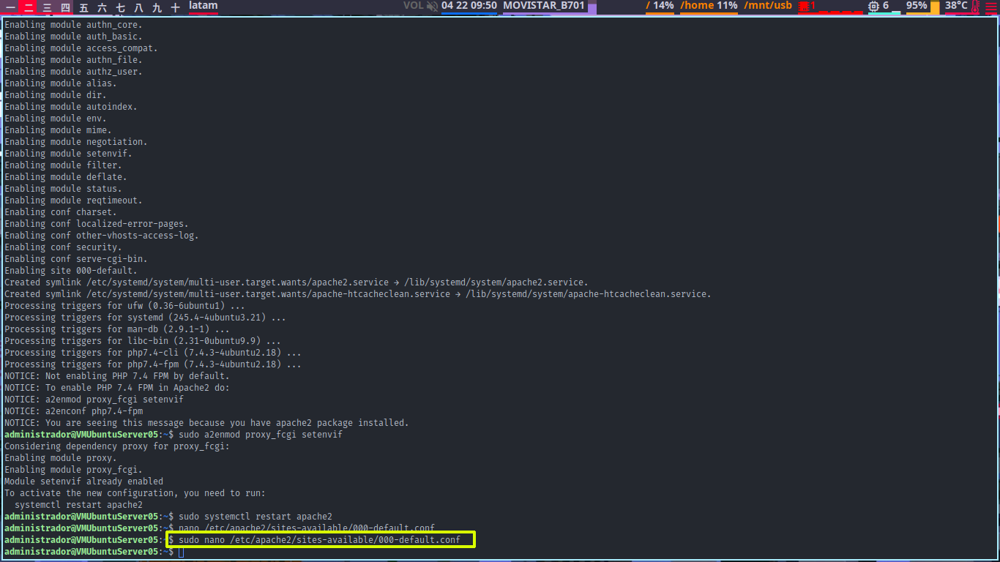
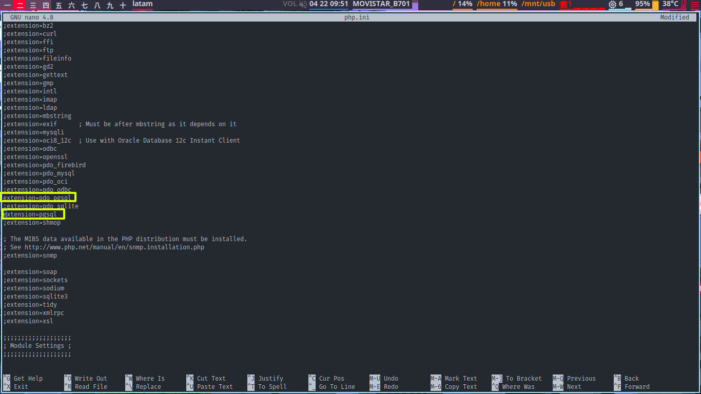
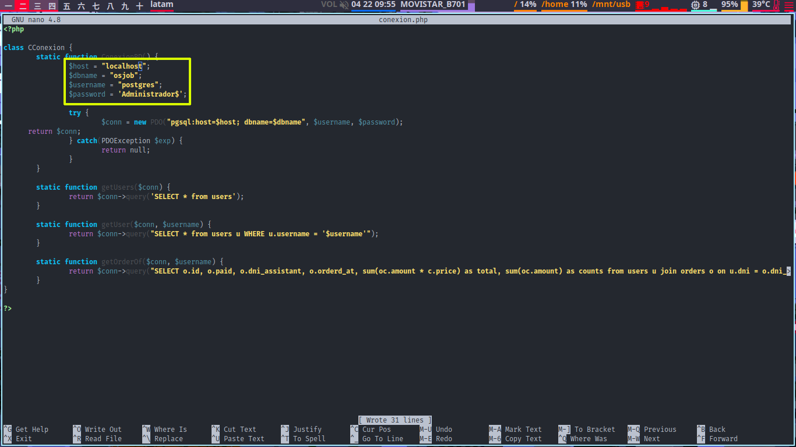

# SimplePhpServer

## Creación de la máquina virtual


habilitar puertos 80(http), 5432(postgres)


## Conexión a la máquina virtual

Conexión a través de ssh.
```bash
ssh Administrador@20.226.56.19
```


Actualización del Sistema operativo.



## Configuración de la capa de datos
Instalación de Postgres 12.
```bash
sudo apt install postgresql postgresql.contrib
```


Start progresql.service.


Habilitar conexiónes a la base de datos.

> host  all  all  0.0.0.0/0  md5


Configurar usuario postgres y crear base de datos `osjob`.


Crear tablas y insertar datos con el archivo <a href="https://gist.github.com/ggonzalesd/0039bfbc64b0c484819ed6948274aff7">dataserver.sql</a>


Conectarse a la base de datos desde la computadora local y mostrar las tablas.



## Configuración de capa de aplicación

Instalación de `apache2` `php7.4` y el adaptador para `postgres12`



Configuración de Apache para reconocer archivos `php`

```xml
<FilesMatch ".php$">
  SetHandler "proxy:unix:/var/run/php/php7.4-fpm.sock|fcgi://localhost"
</FilesMatch>
```


Configuración del php para utilizar el adaptador de `Postgres`



Configurar `/var/www/html`


Clonar el <a href="https://github.com/ggonzalesd/SimplePhpServer">repositorio</a> de la app


Configurar la conexión a la base de datos



## Screenshots


